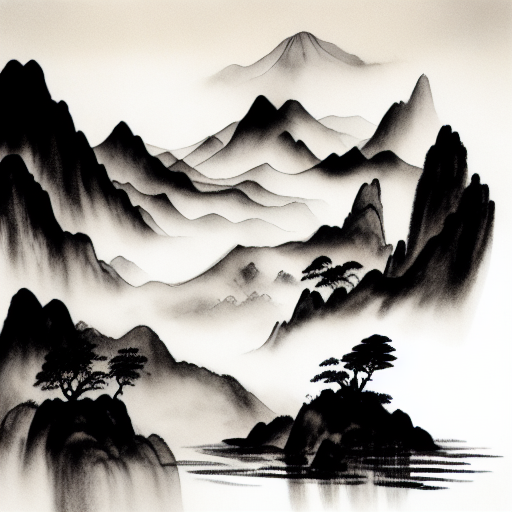
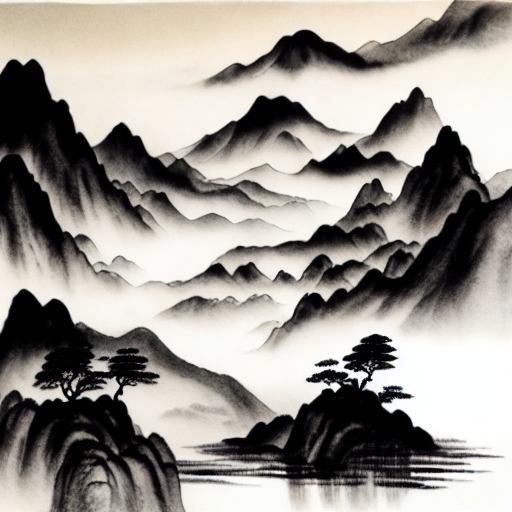

# OLSS (Optimal Linear Subspace Search)

[Optimal Linear Subspace Search: Learning to Construct Fast and High-Quality Schedulers for Diffusion Models](https://arxiv.org/abs/2305.14677)

In this project, we propose a new diffusion scheduler called OLSS. Given a few examples, OLSS can searching for the optimal approximation process of the complete generation process. After searching, OLSS is able to generate high-quality images with a very small number of steps.

在本项目中，我们提出了一个新的名为 OLSS 的 diffusion scheduler. 给定几个例子，OLSS 可以搜索完整生成过程的最优近似过程。在搜索完毕后，OLSS 能够以极少的步数生成高质量的图片。

## Examples 样例

We provide some examples generated by DPM-Solver++ and our OLSS scheduler for comparison. The model we used is `alibaba-pai/pai-diffusion-artist-large-zh`, which is a high-quality Chinese artist model. You can use any other models if you want.

我们提供了一些由 DPM-Solver++ 和 OLSS 生成的例子做对比。我们使用的模型是 `alibaba-pai/pai-diffusion-artist-large-zh`，一个高质量的中文艺术模型，当然，您可以使用任何您喜爱的模型。

### Example 1 样例一

Prompt: 亭台楼阁，曲径通幽，水墨绘画，中国风（Pavilions, terraces and pavilions, winding paths, ink painting, Chinese style）

Seed: 0

|DPM-Solver++ (10 steps)|OLSS (10 steps)|
|-|-|
|||

### Example 2 样例二

Prompt: 层峦叠嶂，水墨绘画，中国风（Many mountains, ink painting, Chinese style）

Seed: 0

|DPM-Solver++ (10 steps)|OLSS (10 steps)|
|-|-|
|||

## Usage 使用

```
pip install diffusers==0.21.3 torch
```

We provide a demo here:

我们在这里提供了一个演示程序：

```python
from diffusers import StableDiffusionPipeline, DDIMScheduler
from olss import SchedulerWrapper


# In this demo, we use our Chinese artist model. You can load any other models if you want.
pipe = StableDiffusionPipeline.from_pretrained("alibaba-pai/pai-diffusion-artist-large-zh")
pipe = pipe.to("cuda")

# Build an OLSS scheduler. This scheduler requires a reference scheduler. We use DDIM here.
pipe.scheduler = SchedulerWrapper(DDIMScheduler.from_config(pipe.scheduler.config))

# Before we generate images using OLSS scheduler, generate some examples to train it.
train_steps = 100
inference_steps = 10
prompt = "亭台楼阁，曲径通幽，水墨绘画，中国风"
for i in range(9):
    image = pipe(prompt=prompt, num_inference_steps=train_steps)["images"][0]
pipe.scheduler.prepare_olss(inference_steps)

# Generate some images using our OLSS scheduler. We can also generate images with other
# prompts. Using similar prompts for training is highly recommended, because OLSS can learn
# to construct a fast and high-quality generation process by analyzing given examples.
prompt = "亭台楼阁，曲径通幽，水墨绘画，中国风"
image = pipe(prompt=prompt, num_inference_steps=inference_steps)["images"][0]
image.save(f"{prompt}.png")
```

