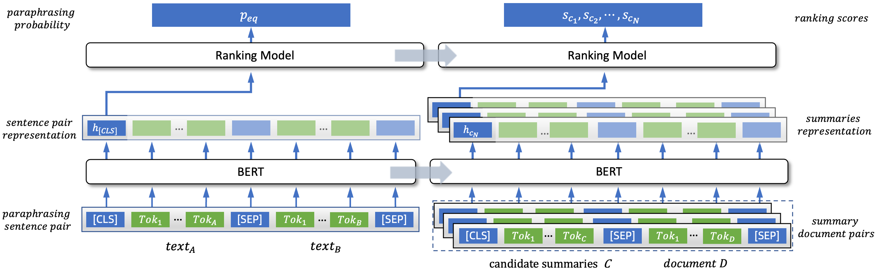

# ParaSum: A Contrastive Paraphrasing Framework for Low-resource Extractive Summarization
Official implementation of "ParaSum: A Contrastive Paraphrasing Framework for Low-resource Extractive Summarization"

## Introduction
In this paper, we introduce a novel paradigm for low-resource extractive summarization, namely ParaSum, which reformulates text summarization as textual paraphrasing to minimize its training gap with Pre-trained Language Models (PLMs) in order to better probe knowledge of PLMs to improve the performance of summarization. Furthermore, to relax the requisition of training data,
we adopt a simple yet efficient model and align the training paradigm of summarization to textual paraphrasing to facilitate network-based transfer learning. 

<div align="center">
  
</div>

## Installation
Our CUDA version is 11.2; Python version is 3.8; our torch versions are as follows:
```bash
torch==1.8.1+cu111
torchaudio==0.8.1
torchvision==0.9.1+cu111
```
You can check your cuda version and install the corresponding torch version follow the [pytorch's official website](https://pytorch.org/get-started/previous-versions/).

Besides, please install dependencies:
```bash
pip install -r requirements.txt -i https://pypi.tuna.tsinghua.edu.cn/simple
```

## Paraphrase Pre-training
### QQP for English Summarization dataset
We have provide the training, validation and test dataset (i.e. QQP) for Paraphrase Pre-training for English Summarization Dataset.

You can download the preprocessed datasets for QQP(10k) by running:
```bash
sh download_qqp.sh
```
The dataset will be downloaded in the current `Path`.

Then, pre-trained the model with QQP dataset by running:
```bash
python paraphrase_pretraining/train_matching.py --save_path /PATH/TO/SAVE/PRE-TRAINED_MODEL/ --data_path /PATH/TO/DOWNLOADED/QQP/DATASET --gpus GPU_ID
```
where `GPU_ID` indicates the GPU id, if you running the code on a multi-gpu server.
### LCQMC for Chinese Summarization dataset
We have provide the training, validation and test dataset (i.e. LCQMC) for Paraphrase Pre-training for Chinese Summarization Dataset.
You can download the preprocessed datasets for LCQMC(10k) by running:
```bash
sh download_lcqmc.sh
```
The dataset will be downloaded in the current `Path`.

Then, pre-trained the model with LCQMC dataset by running:
```bash
python paraphrase_pretraining_CN/train_matching.py --save_path /PATH/TO/SAVE/PRE-TRAINED_MODEL/ --data_path /PATH/TO/DOWNLOADED/QQP/DATASET --gpus GPU_ID
```
where `GPU_ID` indicates the GPU id, if you run this code on a multi-gpu server.
## Model Fine-tuning
### For CNN/DailyMail dataset
#### Prepare dataset for CNNDM
You can download the preprocessed datasets for CNNDM by running:
```bash
sh download_cnndm.sh
```
The dataset will be downloaded in the current `Path`.
#### Training for CNNDM
Then, finetune the model with CNNDM dataset by running:
```bash
python finetune_for_CNNDM/train_matching.py --save_path /PATH/TO/SAVE/PRE-TRAINED_MODEL/ --data_path /PATH/TO/DOWNLOADED/CNNDM/DATASET --restore_from /PATH/TO/QQP/PRETRAINED/MODEL --gpus GPU_ID
```
where `restore_from` indicates the path of the model pretrained with QQP, for example you can set `restore_from` as `/PATH/epoch-42_step-13000_f1_score-0.751379.pt`
#### Test for CNNDM
Test the model by running:
```bash
python finetune_for_CNNDM/test_matching.py --save_path /PATH/TO/SAVED/MODEL/ --data_path /PATH/TO/DOWNLOADED/CNNDM/DATASET --gpus GPU_ID
```
### For Xsum dataset
You can download the preprocessed datasets for Xsum by running:
```bash
sh download_xsum.sh
```
#### Training for XSUM
```bash
python finetune_for_XSUM/train_matching.py --save_path /PATH/TO/SAVE/PRE-TRAINED_MODEL/ --data_path /PATH/TO/DOWNLOADED/XSUM/DATASET --restore_from /PATH/TO/QQP/PRETRAINED/MODEL --gpus GPU_ID
```
where `restore_from` indicates the path of the model pretrained with QQP, for example you can set `restore_from` as `/PATH/epoch-42_step-13000_f1_score-0.751379.pt`
#### Test for XSUM
Test the model by running:
```bash
python finetune_for_XSUM/test_matching.py --save_path /PATH/TO/SAVED/MODEL/ --data_path /PATH/TO/DOWNLOADED/XSUM/DATASET --gpus GPU_ID
```
### For CNewSum dataset
#### Prepare dataset for CNewSum
You can download the preprocessed datasets for CNewSum by running:
```bash
sh download_cnewsum.sh
```
#### Training for CNewSum
```bash
python finetune_for_CNewSum/train_matching.py --save_path /PATH/TO/SAVE/PRE-TRAINED_MODEL/ --data_path /PATH/TO/DOWNLOADED/XSUM/DATASET --restore_from /PATH/TO/QQP/PRETRAINED/MODEL --gpus GPU_ID
```
where `restore_from` indicates the path of the model pretrained with LCQMC, for example you can set `restore_from` as `/PATH/epoch-42_step-13000_f1_score-0.751379.pt`
#### Test for CNewSum
Test the model by running:
```bash
python finetune_for_CNewSum/test_matching.py --save_path /PATH/TO/SAVED/MODEL/ --data_path /PATH/TO/DOWNLOADED/XSUM/DATASET --gpus GPU_ID
```
It is worth noting that CNewSum is a Chinese Summarization Dataset, we utilize [MLROUGE](https://github.com/dqwang122/MLROUGE) for evaluating the model performance indead of ROUGE.
To test the model performance, you should first prepare the decoded files in the required format, run:
```bash
python finetune_for_CNewSum/process_CN.py --result_path /PATH/TO/DECODED/FOLDER  --rouge_result_path ./finetune_for_CNewSum
```
where `result_path` is in the `${save_path}/result/MODEL_NAME`, `rouge_result_path` denotes the path to save the processed decoded files. 

Then, running:
```bash
cd finetune_for_CNewSum/MLROUGE
python3 calRouge.py -c ../candidate.txt -r ../reference.txt -l zh -d "<q>" -t
```
Note: "Cannot open exception db file for reading: data/WordNet-2.0.exc.db"
```bash
cd ROUGE-1.5.5/data/WordNet-2.0-Exceptions/
rm WordNet-2.0.exc.db # only if exist
./buildExeptionDB.pl . exc WordNet-2.0.exc.db

cd ../
rm WordNet-2.0.exc.db # only if exist
ln -s WordNet-2.0-Exceptions/WordNet-2.0.exc.db WordNet-2.0.exc.db
```
## Contributors
[TangMoming](https://github.com/TangMoming)

## Acknowledgement
This repo benefits from [MatchSum](https://github.com/maszhongming/MatchSum).
